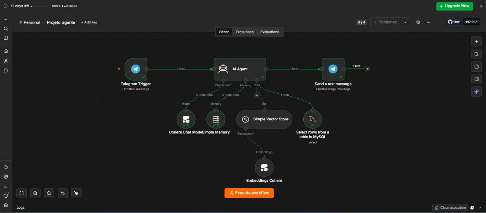
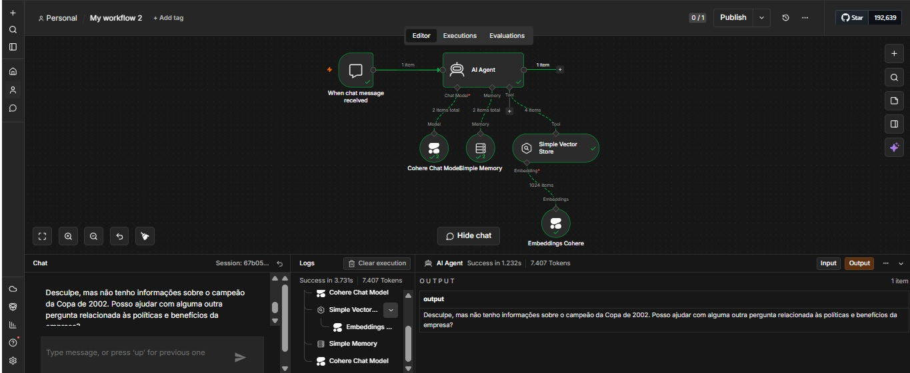
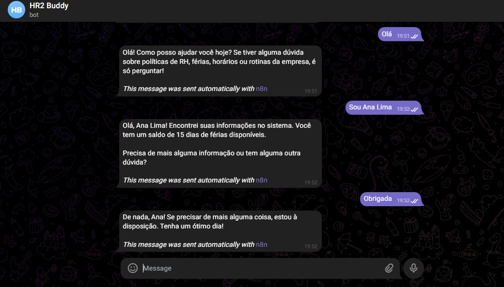

# HR Buddy - Agente de IA para RH

## Objetivo

Desenvolver um agente de IA especializado em Recursos Humanos utilizando RAG (Retrieval-Augmented Generation), memória conversacional e integração com banco de dados MySQL. O projeto permite que usuários realizem consultas sobre políticas internas da empresa por meio do Telegram, recebendo respostas contextualizadas e restritas ao domínio de RH.

## Tecnologias Utilizadas

* n8n
* Cohere Chat Model
* Cohere Embeddings
* Simple Vector Store
* MySQL
* Telegram Bot API
* Railway
* RAG (Retrieval-Augmented Generation)

## Arquitetura

Usuário
↓
Telegram Bot
↓
Telegram Trigger (n8n)
↓
AI Agent
↓
├── Cohere Chat Model
├── Simple Memory
├── Simple Vector Store (RAG)
│      ↓
│   Cohere Embeddings
│
└── MySQL
↓
Telegram Send Message
↓
Usuário

## Funcionalidades

* Recebimento de mensagens através do Telegram
* Respostas utilizando modelo de linguagem Cohere
* Busca semântica em documentos utilizando RAG
* Geração de embeddings para indexação dos documentos
* Armazenamento vetorial através do Simple Vector Store
* Memória conversacional para manter contexto entre mensagens
* Consulta de informações estruturadas armazenadas no MySQL
* Restrição de respostas a assuntos relacionados ao RH
* Integração completa entre Telegram, IA e banco de dados
* Deploy da solução utilizando Railway

## Aprendizados

* Construção de Agentes de IA utilizando n8n
* Implementação de RAG (Retrieval-Augmented Generation)
* Geração e utilização de embeddings para busca semântica
* Integração entre IA e bancos de dados relacionais
* Desenvolvimento de fluxos de automação com n8n
* Implementação de memória conversacional
* Utilização de guardrails para restringir respostas fora do domínio
* Integração de bots com Telegram através de Webhooks
* Deploy e publicação de aplicações utilizando Railway
* Arquitetura de aplicações baseadas em IA Generativa

## Evidências

### Arquitetura Completa do Agente

Fluxo principal do projeto contendo Telegram Trigger, AI Agent, memória conversacional, Vector Store, MySQL e envio das respostas ao usuário.

---

### Consulta sobre Política de Férias

Exemplo de pergunta respondida pelo agente utilizando RAG (Retrieval-Augmented Generation), buscando informações na base de conhecimento indexada.

---

### Guardrail - Pergunta Fora do Contexto

Demonstração da restrição do agente a assuntos relacionados ao RH, evitando respostas fora do domínio definido.

---

### Conversa no Telegram

Exemplo de interação do usuário com o agente através do Telegram, incluindo consulta de informações e respostas contextualizadas.

## Resultado

Neste projeto foi desenvolvido um agente de IA especializado em Recursos Humanos utilizando RAG, memória conversacional e integração com banco de dados MySQL.

A solução permite que usuários realizem consultas através do Telegram, recebendo respostas contextualizadas com base em documentos indexados e dados estruturados armazenados no banco de dados. Além disso, foram implementados mecanismos de restrição de contexto (guardrails), garantindo que o agente responda apenas perguntas relacionadas ao domínio de RH.

A prática possibilitou aplicar conceitos atuais de IA Generativa, busca semântica, embeddings, integração de sistemas, automação com n8n e desenvolvimento de aplicações conversacionais, simulando um cenário próximo ao utilizado em ambientes corporativos.
